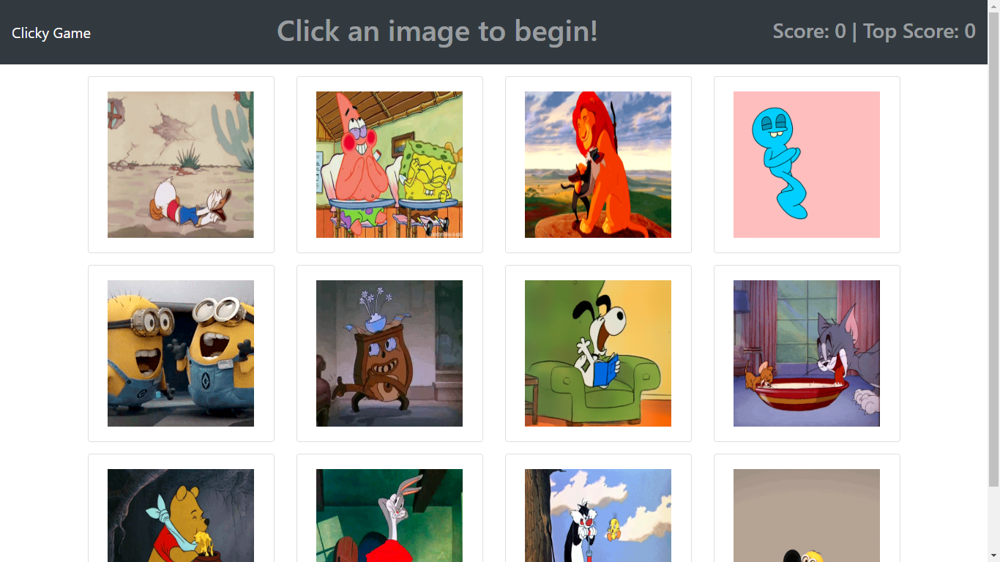

# Clicky Game

### File

* [`Clicky Game`](server.js)

### Technologies
Node, React

CSS Framework - React Bootstrap   

### Description
Clicky Game! is a memory game with React.

* Link: 
     * Site Link: https://shruti-gaonkar.github.io/clicky-game/
     * Github Link: https://github.com/shruti-gaonkar/clicky-game

      

* The application renders different Giphy images to the screen. Each image listens for click events.

* The application keeps track of the user's score. 
    * The user's score is incremented when clicking an image for the first time. 
    
    * The user's score resets to 0 if they click the same image more than once.     

*  Every time an image is clicked, the images rendered to the page shuffle themselves in a random order.

*  Once the user's score is reset after an incorrect guess, the game restarts.
